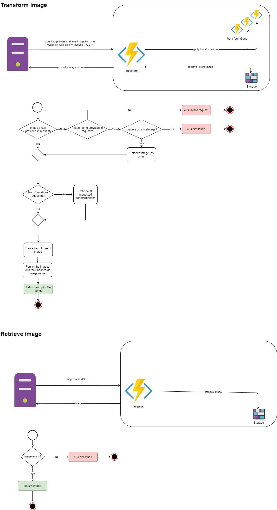

# Portal image
A REST service providing a set of image editing capabilities.


## Architecture


## Endpoints
### POST /api/transform
REST service with which you can
1) store an image
2) generate and store one or multiple transformations of an image
3) perform and store additional transformation on an earlier stored image 

*Form data:*

|field name | type   | required | meaning |
|-----------|--------| -------- |-----|
| image     | file   | only if imageName is not provided      | image you want to (transform and) store |
| imageName | file   | only if image is not provided      | image you want to (transform and) retrieve |
| transformationDefinitions   | json | no      | JSON object containing a description of the transformations you would like to apply to the image. See [transformations](#transformations).   |

 
**Returns:**
An object containing paths to the original version and all requested transformed images.

```json
[
    {"label": "original", "name": "image1"},
    {"label": "medium-grayscale", "name": "image2"},
    {"label": "medium", "name": "image3"}
]
```

**Exceptions:**

| HTTP code | occurs when | preconditions |
|-----| ----- | ---- |
| 404 | if image with given name does not exist | only applicable when imageName is provided |

### GET /api/retrieve/{imageName}
**Returns:** Returns earlier stored image.

**Exceptions:**

| HTTP code | occurs when | preconditions |
|-----| ----- | ---- |
| 404 | if image with given name does not exist |  |


## Transformations

Transformations needs to be provided as a double array.

Example:

```json
[
  {
    "label": "medium-grayscale",
    "transformations": [ 
      { "name": "resize", "width": 500, "height": 400, "crop": true }, 
      { "name": "grayscale"}
    ]
  }, {
    "label": "medium-color",
    "transformations": [ 
      { "name": "resize", "width": 500, "height": 400, "crop": true }
    ]
  }
]
```

results in 
* the original image
* a resized image in grayscale
* a resized image (in color)

```json
{
    "originalImage": "fileName1",
    "1": "fileName2",
    "2": "fileName3"
}
```

### Resize
Resizes the image to a desired size.

|field name | type   | required | meaning |
|-----------|--------| -------- |-----|
| width     | number   | yes      | Width in pixels. |
| height   | number | no      | Height in pixels. If no height is given, the aspect ratio of the image is respected. |
| crop   | boolean | no      | If both width and height are given, and the aspect ratio of the desired image does not match the aspect ratio of the source image, is it allowed to crop the image so that the aspect ratio can be respected? |

### Greyscale
Turns an image into greyscale.

No options available.

## Development
### What do I need to do to install the app?
1. Install Node 13+
1. `npm install`

### How to start the app?
`node app/app.js`

### How to run tests?
`npm test`

As a testing framework, this project uses [AVA](https://github.com/avajs/ava).
The testing requirements for this project are simple, so I looked for a simple, due relatively popular, testing framework.

### How to build the Docker image?
`docker build . --tag=stainii/portal-image:[version]`

### How to publish?
`docker login`
`docker push stainii/portal-image:[version]`

### Release
TODO